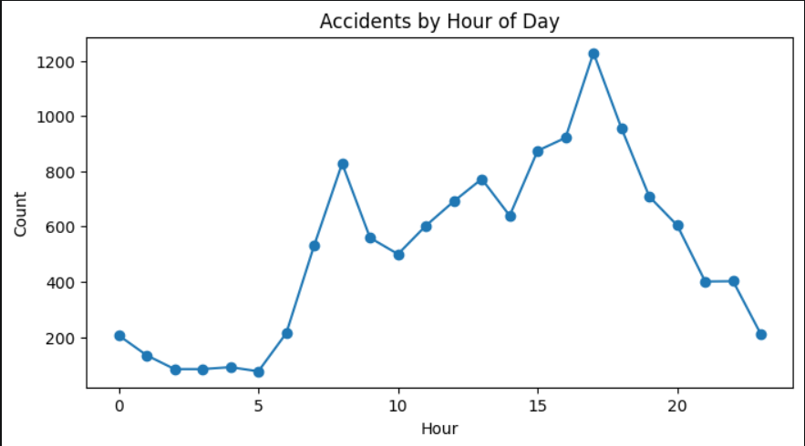
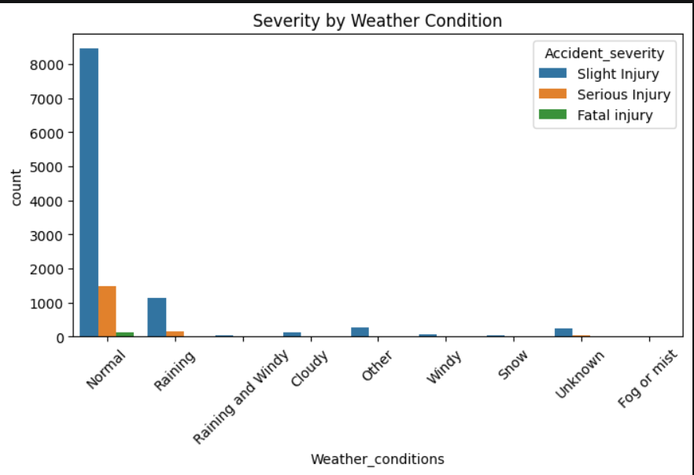
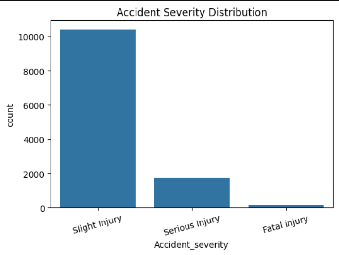
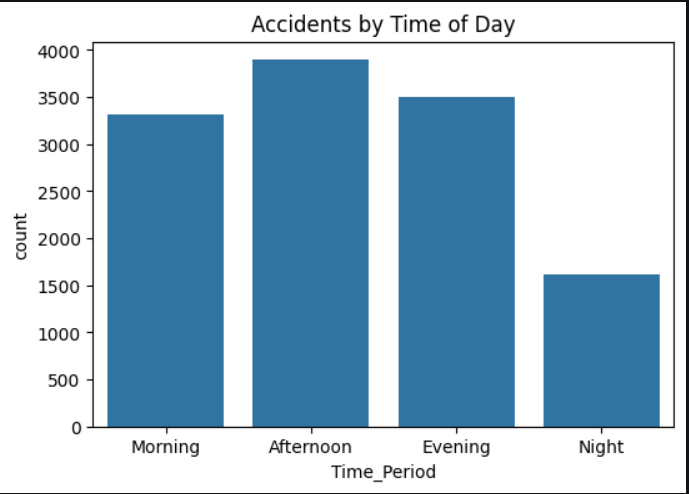

# Road Traffic Accident Analysis

## Project Overview

This project analyzes road traffic accident data to identify patterns and trends related to accident severity, time of day, accident frequency, and weather conditions.

The analysis was performed using Python with Pandas, Matplotlib, and Seaborn. Exploratory Data Analysis (EDA) and visualizations were used to extract meaningful insights from the dataset.

## Objectives

- Analyze the distribution of accident severity
- Identify accident patterns by hour of the day
- Analyze accident frequency across different time periods
- Examine accident severity across different weather conditions
- Identify key patterns and trends in road traffic accidents

## Tools & Technologies

- Python
- Pandas
- NumPy
- Matplotlib
- Seaborn
- Jupyter Notebook

## Analysis Performed

- Data loading and inspection
- Data cleaning and preprocessing
- Missing-value analysis
- Duplicate-value analysis
- Data type analysis
- Feature engineering
- Accident severity analysis
- Hour-wise accident analysis
- Time-of-day analysis
- Weather-condition analysis
- Exploratory Data Analysis
- Data visualization

## Key Insights

- Slight Injury accidents represent the largest share of recorded accidents.
- Accident frequency varies considerably across different hours of the day.
- Afternoon and evening periods account for a significant number of recorded accidents.
- Accident severity varies across different weather conditions.
- Hour-wise analysis highlights specific periods with relatively higher accident frequencies.

## Visualizations

### Accidents by Hour of Day

### Severity by Weather Condition

### Accident Severity Distribution

### Accidents by Time of Day

## Project Workflow

Data Collection  
↓  
Data Cleaning & Preprocessing  
↓  
Feature Engineering  
↓  
Exploratory Data Analysis  
↓  
Data Visualization  
↓  
Insights & Findings

## Project Files

- `Road_Traffic_Accident_Analysis.ipynb` - Complete Python analysis and visualizations
- `accident.csv` - Dataset used for the analysis
- `screenshots/` - Project visualization screenshots

## Author

**Sridhar**

Aspiring Data Analyst | Python | SQL | Power BI | Excel
